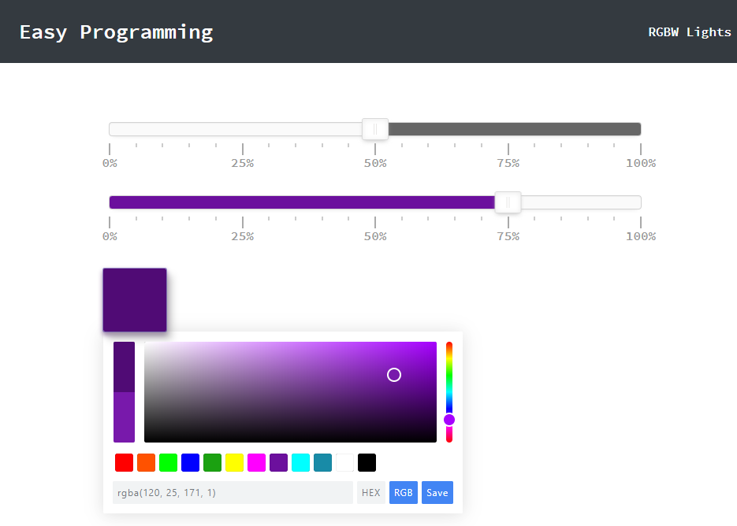

# Raspberry Pi - Control RGBW LED Strip from your browser

Controlling RGBW LED Strip lights from your browser with a Raspberry Pi Zero.

<center>

</center>

## Getting Started

This project contains the tutorial files for EasyProgramming.net. 

If you've followed my other tutorials, browser control should be something that is familiar to you. The requirements below should also be very familiar:

### Hardware

In order to complete this project, you will need some of these hardware:

* [ ] Raspberry Pi - can use Zero, Zero W, 2, 3, 4
* [ ] *(Optional)* Wireless dongle - If you are using the basic Pi 0 v1.3. This is not necessary for the other versions of the Pi.
* [ ] RGBW LED Strip - These normally have 5 connections, One for each color and an additional for Ground. 
* [ ] Pi Power Supply - need 5V to your Pi
* [ ] LED Strip Power Supply - 12V power adapter passing 1-2 Amps of current will be sufficient. This should also work with a 24V LED Strip.
* [ ] Logic Level MOSFET Transistor - I use MOSFETS for this project. They can be any logic-level transistor (most of them start with IRL - the L is for 'logic'). 
It just needs to be able to turn on with 5v or less of power.
* [ ] Wiring - You need 5 wires to connect the LEDs and Ground. You can find adapters or you can use individual wires. 
* [ ] *(Optional)* Aluminum Extrusion - although not necessary, an aluminum extrusion will help dissipate heat as well as make your installation more sturdy.
* [ ] *(Optional)* Pi Case - Something to house your Pi and Relay. You can make your own or if you want, you can just leave it as is but be careful of shorts 
and electric shocks!
* [ ] *(Optional)* Soldering Iron - if you are comfortable, it is best to solder the lights and connections in place so they don't disconnect easily. 
* [ ] Tools - a wire cutter/stripper would be most helpful to you.  

### Prerequisites
The prerequisites for this tutorial is the same as the last because everything in this tutorial is the end product of what we've learned so far about 
the Raspberry Pi and some things we learned with JavaScript and jQuery. If you get stuck anywhere, take a look at these tutorials:

1. [Headless Raspberry Pi](https://www.easyprogramming.net/raspberrypi/headless_raspbery_pi.php)
2. Previously we needed RPi.GPIO library, for this, we need pigpiod - More info at http://abyz.me.uk/rpi/pigpio/pigpiod.html
3. [Run Apache on your Pi](https://www.easyprogramming.net/raspberrypi/pi_apache_web_server.php)
4. [Running a Flask App on your Pi](https://www.easyprogramming.net/raspberrypi/pi_flask_app_server.php)
5. [Run Flask behind Apache](https://www.easyprogramming.net/raspberrypi/pi_flask_apache.php)
6. [Simple AJAX with jQuery/JavaScript](https://www.easyprogramming.net/jQuery/get_data_ajax_method.php)

### Installation 

Follow the tutorial here to learn how to run a Flask app behind Apache: https://www.easyprogramming.net/raspberrypi/pi_flask_apache.php

As stated in the above tutorial and in the [Prerequisites](#prerequisites), here's a very quick checklist for this project:

* [ ] Apache
* [ ] venv (virtual environment)
* [ ] `activate-this.py` inside your venv
* [ ] Mod-WSGI [More info below](#apche-and-wsgi)
* [] `pigpiod`

As stated in the last point above, we need to install `pigpiod`:

```bash
wget abyz.me.uk/rpi/pigpio/pigpio.zip
unzip pigpio.zip
cd PIGPIO
make
sudo make install
```

I will also include a version of the zip in this repo as a backup. 

After you install `pigpiod`, run it with:

```bash
sudo pigpiod
```

Technically, you can run this outside of `venv` and it'll still work, because it's running globally and our virtual environment will have access to the daemon. But we still
need the library in our venv, so while activated inside your virtual environment, install `pigpio` with:

```bash
pip install pigpio
```

Now when we run our `pigpio` commands, we won't get an error.

### The Stack

#### JavaScript - Script.js - Frontend

The `script.js` has jQuery that calls the Flask app using simple AJAX calls. They assume that the path for the flask app is `/api/lr` - 
if you use another path, change this in the JavaScript to avoid getting 404s on your AJAX calls. You can also modify the API endpoints in `rgbw.py`.

The script also utilizes [Pickr](https://github.com/Simonwep/pickr) for the color picker. If updates are needed, feel free to look at that repo and grab the latest. 

##### Configurable options

This config object in `script.js` allows you to configure the  URL for your Pi. The default is an ip address but if you can access your Pi via a hostname or domain name,
just chnage the url properly to reflect the address: 
```javascript
let config = {
    url: 'http://{{ip_addr}'
};
```

##### Cache Busting

I use a basic cache busting system in the JavaScript by looking at the current time for the request and appending it to the AJAX request looking for `status.txt` because 
I've noticed that browsers love to store this in memory, especially mobile browsers. This ensures that we don't have to worry about caching.  

#### Apache and WSGI - Web Server

The `rgbw.wsgi` file should be placed in the same directory as `rgbw.py` which contains your Flask controllers. Make sure the paths for `activate_this.py` and `rgbw.py` match
your installation. If you rename the flask controller, you have edit the `wsgi` file to reflect the changes. 

Take the `utils/apache-led.conf` configuration file and place it in the appropriate Apache/sites-available directory and enable it with with:

```bash
sudo a2ensite apache-led.conf
```

Feel free to use your own configuration and name it anything you want! This should be used as a template.
 
Once that's done, restart Apache with:

```bash
sudo service apache2 restart
```

If you get a WSGI error, your Pi may not have Mod-WSGI installed. Run the following and restart apache:

```bash
sudo apt install libapache2-mod-wsgi-py3 -y
``` 

**Note** the apache configuration enables `CORS` from all origins. If you don't want to enable CORS and want to handle these requests another way, 
remove this line in `apache-led.conf`:

```
Header set Access-Control-Allow-Origin "*"
```

IF you have this enable, you must enable `mod_headers` on your Pi with the following command for this to work:

```bash
sudo a2enmod headers
```

As long as you don't open your Pi to the outside world, you should be fine. You can also specify which origins are allowed to make requests.  


If everything is set up correctly, the AJAX call will happen with the following url: `http://{{ip_addr}}/api/kitchen?status=on`

Only a status of `on` or `off` are accepted. Anything else will return a simple error message. Open up the JavaScript console for more info.  

### API endpoints

#### `/api/lr?red=255&green=255&blue=255`

You can pass in 4 different query string parameters of red, green, and bluewith values of 0 to 255. A value of 0 means off (or no power) 
and 255 means on (or full power). Different combinations will cause different colors and brightnesses. The Frontend should allow you to send these
using a color picker.

These parameters are optional. If they are not sent, they will automatically be given a value of 0. For example, the following request:

```
/api/lr?red=255&blue=150 
```

Will return this:

```json
{
    "blue": 150,
    "green": 0,
    "red": "255",
}
```

Sending no values will turn the lights off.

#### `/api/lr/white?white=255`

The white lights were separated for simplicity. Since the frontend color picker only produces Red, Green, and Blue color codes, the white was left out. For simplicity, 
I've separated it so it can be turned on and off with a button instead. I will apply a brightness option later.  

#### `/api/lr/getStatus?colors=rgb/white'

The states of the lights are held in two different JSON files. `rgb.json` which houses the Red, Green, and blue Color statuses. And `white.json` which houses the on/off
status of the white light. You can pass in the query parameter `colors` and either `rgb` or `white` as a value to get the different states. 

This data is used when the page is refreshed or loaded for the first time, then you know what color your lights are on.

**Note**: `rgbw.py` needs to state the full path to the JSON files.  It is currently set to `/var/www/html/rgbw/*.json` - if you need to host this elsewhere, change this. 
The user Pi needs to be able to write to these files as well. 

I include these files in the repo because if they don't exist, the app throws a 500 Internal Server Error. By default, all values are 0.     

### Crontab
When the Pi first boots, `pigpiod` is not automatically started. To ensure that it starts properly,  I'd recommend entering this into your crontab. First edit crontab with this:

```bash
crontab -e
```

Then enter this in the file and save:

```
@reboot sudo pigpiod
```

If you don't do this, the next time your Pi reboots, `pigpiod` won't be running and your lights won't work until you turn it on. 

## Authors
* **Nazmus Nasir** - [Nazm.us](https://nazm.us) - Owner of EasyProgramming.net

## License

This project is licensed under the MIT License - see the [LICENSE.md](LICENSE.md) file for details

# Questions ?
Have questions? You can reach me through several different channels. You can ask a question in the  [issues forum](/../../issues), 
on [EasyProgramming.net](https://www.easyprogramming.net), or on the vide comments on YouTube. 


# Contribute 
I will accept Pull requests fixing bugs or adding new features after I've vetted them. Feel free to create pull requests! 